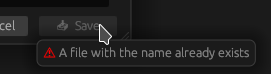

# egui-file-dialog changelog

## Unreleased - v0.6.0
### ✨ Features
- Added the ability to pin folders to the left sidebar and enable or disable the feature with `FileDialog::show_pinned_folders` [#100](https://github.com/fluxxcode/egui-file-dialog/pull/100)
- Added `FileDialogConfig::storage`, `FileDialog::storage` and `FileDialog::storage_mut` to be able to save and load persistent data [#104](https://github.com/fluxxcode/egui-file-dialog/pull/104) and [#105](https://github.com/fluxxcode/egui-file-dialog/pull/105)
- Added new modal and option `FileDialog::allow_file_overwrite` to allow overwriting an already existing file when the dialog is in `DialogMode::SaveFile` mode [#106](https://github.com/fluxxcode/egui-file-dialog/pull/106)
- Implemented customizable keyboard navigation using `FileDialogKeybindings` and `FileDialog::keybindings` [#110](https://github.com/fluxxcode/egui-file-dialog/pull/110)
- Implemented show hidden files and folders option [#111](https://github.com/fluxxcode/egui-file-dialog/pull/111)

### ☢️ Deprecated
- Deprecated `FileDialog::overwrite_config`. Use `FileDialog::with_config` and `FileDialog::config_mut` instead [#103](https://github.com/fluxxcode/egui-file-dialog/pull/103)

### 🐛 Bug Fixes
- Fixed the size of the path edit input box and fixed an issue where the path edit would not close when clicking the apply button [#102](https://github.com/fluxxcode/egui-file-dialog/pull/102)

### 🔧 Changes
- Restructured `config` module and fixed new `1.78` clippy warnings [#109](https://github.com/fluxxcode/egui-file-dialog/pull/109)
- The reload button has been changed to a menu button. This menu contains the reload button and the “Show hidden" option [#111](https://github.com/fluxxcode/egui-file-dialog/pull/111)

### 📚 Documentation
- Added `persistence` example showing how to save the persistent data of the file dialog [#107](https://github.com/fluxxcode/egui-file-dialog/pull/107)

## 2024-03-30 - v0.5.0 - egui update and QoL changes
### 🚨 Breaking Changes
- Updated `egui` from version `0.26.0` to version `0.27.1` [#97](https://github.com/fluxxcode/egui-file-dialog/pull/97)

### ✨ Features
- Added `FileDialog::add_quick_access` and `FileDialogConfig::add_quick_access` to add your own quick access sections to the left sidebar [#95](https://github.com/fluxxcode/egui-file-dialog/pull/95)

### 🔧 Changes
- Automatically edit filter string when user is typing [#93](https://github.com/fluxxcode/egui-file-dialog/pull/93) (thanks [@crumblingstatue](https://github.com/crumblingstatue) and [@aymey](https://github.com/aymey)!)

## 2024-02-29 - v0.4.0 - Customization
### 🖥 UI
- Changed default file icon from `🖹 (document with text U+1F5B9)` to `🗋 (empty document U+1F5CB)` [#74](https://github.com/fluxxcode/egui-file-dialog/pull/74) \
  
- You can now text edit the path using the new edit button next to the current path 🖊 [#85](https://github.com/fluxxcode/egui-file-dialog/pull/85) \
   \
  

### ✨ Features
- Added `FileDialog::take_selected` as an alternative to `FileDialog::selected` [#52](https://github.com/fluxxcode/egui-file-dialog/pull/52)
- Added `FileDialogConfig`, `FileDialog::with_config`, `FileDialog::overwrite_config` and `FileDialog::config_mut` to set and override the configuration of a file dialog. This is useful if you want to configure multiple `FileDialog` objects with the same options. [#58](https://github.com/fluxxcode/egui-file-dialog/pull/58), [#67](https://github.com/fluxxcode/egui-file-dialog/pull/67) and [#79](https://github.com/fluxxcode/egui-file-dialog/pull/79)
- Added `FileDialogLabels`, `FileDialog::labels` and `FileDialog::labels_mut` to customize the labels used by the dialog and enable multilingual support [#69](https://github.com/fluxxcode/egui-file-dialog/pull/69) and [#79](https://github.com/fluxxcode/egui-file-dialog/pull/79)
- Added `FileDialog::directory_separator` to overwrite the directory separator that is used when displaying the current path [#68](https://github.com/fluxxcode/egui-file-dialog/pull/68)
- Added `FileDialog::err_icon`, `FileDialog::default_folder_icon` and `FileDialog::default_file_icon` to customize the respective icons [#72](https://github.com/fluxxcode/egui-file-dialog/pull/72) Renamed with [#74](https://github.com/fluxxcode/egui-file-dialog/pull/74)
- Added `FileDialog::set_file_icon` and `FileDialogConfig::set_file_icon` to customize the icon for different types of files and directories [#74](https://github.com/fluxxcode/egui-file-dialog/pull/74)
- Added `FileDialog::device_icon` and `FileDialog::removable_device_icon` to overwrite the icon that is used to display devices in the left panel. [#75](https://github.com/fluxxcode/egui-file-dialog/pull/75)
- Added `FileDialog::canonicalize_paths` to set if the paths in the file dialog should be canonicalized before use [#77](https://github.com/fluxxcode/egui-file-dialog/pull/77)

#### Methods for showing or hiding certain dialog areas and functions
- Added `FileDialog::show_top_panel` to show or hide the top panel [#60](https://github.com/fluxxcode/egui-file-dialog/pull/60)
- Added `FileDialog::show_parent_button`, `FileDialog::show_back_button` and `FileDialog::show_forward_button` to show or hide the individual navigation buttons in the top panel. [#61](https://github.com/fluxxcode/egui-file-dialog/pull/61)
- Added `FileDialog::show_new_folder_button` to show or hide the button to create a new folder [#62](https://github.com/fluxxcode/egui-file-dialog/pull/62)
- Added `FileDialog::show_current_path` to show or hide the current path in the top panel [#63](https://github.com/fluxxcode/egui-file-dialog/pull/63)
- Added `FileDialog::show_path_edit_button` to show or hide the button to text edit the current path [#85](https://github.com/fluxxcode/egui-file-dialog/pull/85)
- Added `FileDialog::show_reload_button` to show or hide the reload button in the top panel [#64](https://github.com/fluxxcode/egui-file-dialog/pull/64)
- Added `FileDialog::show_search` to show or hide the search in the top panel [#65](https://github.com/fluxxcode/egui-file-dialog/pull/65)
- Added `FileDialog::show_left_panel` to show or hide the left panel  [#54](https://github.com/fluxxcode/egui-file-dialog/pull/54)
- Added `FileDialog::show_places`, `FileDialog::show_devices` and `FileDialog::show_removable_devices` to show or hide individual section of the left panel [#57](https://github.com/fluxxcode/egui-file-dialog/pull/57)

### 🐛 Bug Fixes
- Fixed not every path being canonicalized [#76](https://github.com/fluxxcode/egui-file-dialog/pull/76)

### 🔧 Changes
- Cleanup and restructure `FileDialog` UI methods [#56](https://github.com/fluxxcode/egui-file-dialog/pull/56)
- Changed so the window title is evaluated when updating the dialog [#80](https://github.com/fluxxcode/egui-file-dialog/pull/80)
- Added Rust cache to CI and updated CI to also check the examples [#84](https://github.com/fluxxcode/egui-file-dialog/pull/84)
- Search input is now reset when a new directory is opened [#88](https://github.com/fluxxcode/egui-file-dialog/pull/88) (thanks [@aymey](https://github.com/aymey)!)

### 📚 Documentation
- Added downloads and total lines badge to `README.md` [#71](https://github.com/fluxxcode/egui-file-dialog/pull/71)
- Updated project description, features and planned features in `README.md` [#78](https://github.com/fluxxcode/egui-file-dialog/pull/78)
- Added customization example to `README.md` and `lib.rs` [#83](https://github.com/fluxxcode/egui-file-dialog/pull/83)
- Added multilingual example to `README.md`, `lib.rs` and an interactive example in `examples/` [#81](https://github.com/fluxxcode/egui-file-dialog/pull/81)
- Updated demo and example screenshots to include new path edit button [#86](https://github.com/fluxxcode/egui-file-dialog/pull/86)

## 2024-02-20 - v0.3.1 - Bug fixes
### 🐛 Bug Fixes
- Fixed not being able to select a shortcut directory like Home or Documents [#43](https://github.com/fluxxcode/egui-file-dialog/pull/43)
- Fixed issue where root directories were not displayed correctly [#44](https://github.com/fluxxcode/egui-file-dialog/pull/44) and [#48](https://github.com/fluxxcode/egui-file-dialog/pull/48)

### 🔧 Changes
- Updated CI to also run on release branches [#46](https://github.com/fluxxcode/egui-file-dialog/pull/46)

### 📚 Documentation
- `FileDialog::update` has been moved up in the documentation [#47](https://github.com/fluxxcode/egui-file-dialog/pull/47)
- Added "Pinnable folders" to planned features in `README.md` [#49](https://github.com/fluxxcode/egui-file-dialog/pull/49)

## 2024-02-18 - v0.3.0 - UI improvements
### 🖥 UI
- Updated bottom panel so that the dialog can also be resized in `DialogMode::SaveFile` or when selecting a file or directory with a long name [#32](https://github.com/fluxxcode/egui-file-dialog/pull/32)
  - The error when saving a file is now displayed as a tooltip when hovering over the grayed out save button \
    
  - Updated file name input to use all available space
  - Added scroll area around the selected item, so that long file names can be displayed without making the dialog larger
- The default minimum window size has been further reduced to `(340.0, 170.0)` [#32](https://github.com/fluxxcode/egui-file-dialog/pull/32)
- Added an error icon to the error message when creating a new folder [#32](https://github.com/fluxxcode/egui-file-dialog/pull/32) \
  
- Removable devices are now listed in a separate devices section [#34](https://github.com/fluxxcode/egui-file-dialog/pull/34)
- Added mount point to the disk names on Windows [#38](https://github.com/fluxxcode/egui-file-dialog/pull/38)

### 🔧 Changes
- Restructure `file_dialog.rs` [#36](https://github.com/fluxxcode/egui-file-dialog/pull/36)

### 📚 Documentation
- Fix typos in the documentation [#29](https://github.com/fluxxcode/egui-file-dialog/pull/29)
- Fix eframe version in the example in `README.md` [#30](https://github.com/fluxxcode/egui-file-dialog/pull/30)
- Added "Planned features” section to `README.md` and minor improvements [#31](https://github.com/fluxxcode/egui-file-dialog/pull/31) (Renamed with [#35](https://github.com/fluxxcode/egui-file-dialog/pull/35))
- Updated example screenshot in `README.md` to include new "Removable Devices" section [#34](https://github.com/fluxxcode/egui-file-dialog/pull/34)
- Moved media files from `doc/img/` to `media/` [#37](https://github.com/fluxxcode/egui-file-dialog/pull/37)

## 2024-02-07 - v0.2.0 - API improvements
### 🚨 Breaking Changes
- Rename `FileDialog::default_window_size` to `FileDialog::default_size` [#14](https://github.com/fluxxcode/egui-file-dialog/pull/14)
- Added attribute `operation_id` to `FileDialog::open` [#25](https://github.com/fluxxcode/egui-file-dialog/pull/25)

### ✨ Features
- Implemented `operation_id` so the dialog can be used for multiple different actions in a single view [#25](https://github.com/fluxxcode/egui-file-dialog/pull/25)
- Added `FileDialog::anchor` to overwrite the window anchor [#11](https://github.com/fluxxcode/egui-file-dialog/pull/11)
- Added `FileDialog::title` to overwrite the window title [#12](https://github.com/fluxxcode/egui-file-dialog/pull/12)
- Added `FileDialog::resizable` to set if the window is resizable [#15](https://github.com/fluxxcode/egui-file-dialog/pull/15)
- Added `FileDialog::movable` to set if the window is movable [#15](https://github.com/fluxxcode/egui-file-dialog/pull/15)
- Added `FileDialog::id` to set the ID of the window [#16](https://github.com/fluxxcode/egui-file-dialog/pull/16)
- Added `FileDialog::fixed_pos` and `FileDialog::default_pos` to set the position of the window [#17](https://github.com/fluxxcode/egui-file-dialog/pull/17)
- Added `FileDialog::min_size` and `FileDialog::max_size` to set the minimum and maximum size of the window [#21](https://github.com/fluxxcode/egui-file-dialog/pull/21)
- Added `FileDialog::title_bar` to enable or disable the title bar of the window [#23](https://github.com/fluxxcode/egui-file-dialog/pull/23)

### 🐛 Bug Fixes
- Fixed issue where no error message was displayed when creating a folder [#18](https://github.com/fluxxcode/egui-file-dialog/pull/18)
- Fixed an issue where the same disk can be loaded multiple times in a row on Windows [#26](https://github.com/fluxxcode/egui-file-dialog/pull/26)

### 🔧 Changes
- Removed the version of `egui-file-dialog` in the examples [#8](https://github.com/fluxxcode/egui-file-dialog/pull/8)
- Use `ui.add_enabled` instead of custom `ui.rs` module [#22](https://github.com/fluxxcode/egui-file-dialog/pull/22)

#### Dependency updates:
- Updated egui to version `0.26.0` [#24](https://github.com/fluxxcode/egui-file-dialog/pull/24)

### 📚 Documentation
- Fix syntax highlighting on crates.io [#9](https://github.com/fluxxcode/egui-file-dialog/pull/9)
- Added dependency badge to `README.md` [#10](https://github.com/fluxxcode/egui-file-dialog/pull/10)
- Updated docs badge to use shields.io [#19](https://github.com/fluxxcode/egui-file-dialog/pull/19)

## 2024-02-03 - v0.1.0

Initial release of the file dialog.

The following features are included in this release:
- Select a file or a directory
- Save a file (Prompt user for a destination path)
- Create a new folder
- Navigation buttons to open the parent or previous directories
- Search for items in a directory
- Shortcut for user directories (Home, Documents, ...) and system disks
- Resizable window
