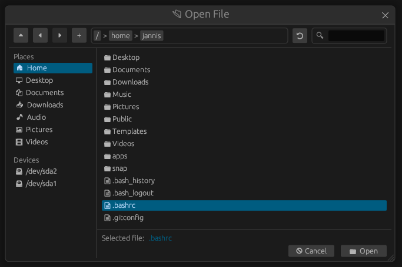

# egui-file-dialog
This repository provides an easy-to-use file dialog (a.k.a. file explorer, file picker) for [egui](https://github.com/emilk/egui). This makes it possible to use a file dialog directly in the egui application without having to rely on the file explorer of the operating system.



The goal for the future is that parts of the dialog can be dynamically adapted so that it can be used in different situations. One goal, for example, is that the labels can be dynamically adjusted to support different languages.

The project is currently in a very early version. Some planned features are still missing and some improvements still need to be made.

**NOTE**: As long as version 1.0.0 has not yet been reached, even minor version increases may contain breaking changes.

**Currently only tested on Linux and Windows!**

## Features
- Select a file or a directory
- Save a file (Prompt user for a destination path)
- Create a new folder
- Navigation buttons to open the parent or previous directories
- Search for items in a directory
- Shortcut for user directories (Home, Documents, ...) and system disks
- Resizable window

## Example
The following example shows the basic use of the file dialog with [eframe](https://github.com/emilk/egui/tree/master/crates/eframe) to select a file.

Cargo.toml:
```toml
[dependencies]
eframe = "0.25.0"
egui-file-dialog = "0.1.0"
```

main.rs:
```rs
use std::path::PathBuf;

use eframe::egui;
use egui_file_dialog::FileDialog;

struct MyApp {
    file_dialog: FileDialog,
    selected_file: Option<PathBuf>,
}

impl MyApp {
    pub fn new(_cc: &eframe::CreationContext) -> Self {
        Self {
            // Create a new file dialog object
            file_dialog: FileDialog::new(),
            selected_file: None,
        }
    }
}

impl eframe::App for MyApp {
    fn update(&mut self, ctx: &egui::Context, _frame: &mut eframe::Frame) {
        egui::CentralPanel::default().show(ctx, |ui| {
            if ui.button("Select file").clicked() {
                // Open the file dialog to select a file.
                self.file_dialog.select_file();
            }

            ui.label(format!("Selected file: {:?}", self.selected_file));

            // Update the dialog and check if the user selected a file
            if let Some(path) = self.file_dialog.update(ctx).selected() {
                self.selected_file = Some(path.to_path_buf());
            }
        });
    }
}

fn main() -> eframe::Result<()> {
    eframe::run_native(
        "File dialog demo",
        eframe::NativeOptions::default(),
        Box::new(|ctx| Box::new(MyApp::new(ctx))),
    )
}
```
