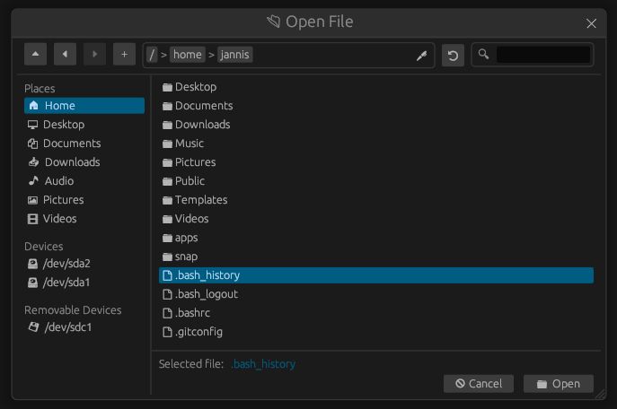
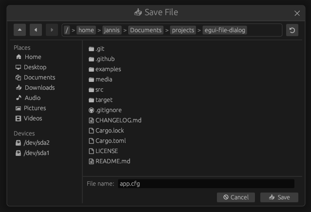

# egui-file-dialog
[](https://crates.io/crates/egui-file-dialog)
[](https://docs.rs/egui-file-dialog)
[](https://deps.rs/repo/github/fluxxcode/egui-file-dialog)

[](https://github.com/fluxxcode/egui-file-dialog/)
[](https://github.com/fluxxcode/egui-file-dialog/blob/master/LICENSE)

<details>
<summary>Table of contents</summary>

1. [Features](#features)
1. [Example](#example)
1. [Keybindings](#keybindings)
1. [Customization](#customization)
1. [Multilingual support](#multilingual-support)
1. [Persistent data](#persistent-data)

</details>

This repository provides an easy-to-use and customizable file dialog (a.k.a. file explorer, file picker) for [egui](https://github.com/emilk/egui).

The file dialog is intended for use by desktop applications, allowing the use of a file dialog directly within the egui application without relying on the operating system's file explorer. This also ensures that the file dialog looks the same and provides the same functionality on all platforms.



The latest changes included in the next release can be found in the [CHANGELOG.md](https://github.com/fluxxcode/egui-file-dialog/blob/develop/CHANGELOG.md) file on the develop branch.

**Currently only tested on Linux and Windows!**

## Features
- Select a file or a directory
- Save a file (Prompt user for a destination path)
  - Dialog to ask the user if the existing file should be overwritten
- Open the dialog in a normal or modal window
- Create a new folder
- Keyboard navigation
- Option to show or hide hidden files and folders
- Navigation buttons to open the parent or previous directories
- Search for items in a directory
- Shortcut for user directories (Home, Documents, ...) and system disks
- Pin folders to the left sidebar
- Manually edit the path via text
- Customization highlights:
  - Customize which areas and functions of the dialog are visible
  - Customize the text labels used by the dialog to enable multilingual support
  - Customize file and folder icons
  - Add custom quick access sections to the left sidebar
  - Customize keybindings used by the file dialog

## Example
Detailed examples that can be run can be found in the [examples](https://github.com/fluxxcode/egui-file-dialog/tree/master/examples) folder.

The following example shows the basic use of the file dialog with [eframe](https://github.com/emilk/egui/tree/master/crates/eframe) to select a file.

Cargo.toml:
```toml
[dependencies]
eframe = "0.27.1"
egui-file-dialog = "0.5.0"
```

main.rs:
```rust
use std::path::PathBuf;

use eframe::egui;
use egui_file_dialog::FileDialog;

struct MyApp {
    file_dialog: FileDialog,
    selected_file: Option<PathBuf>,
}

impl MyApp {
    pub fn new(_cc: &eframe::CreationContext) -> Self {
        Self {
            // Create a new file dialog object
            file_dialog: FileDialog::new(),
            selected_file: None,
        }
    }
}

impl eframe::App for MyApp {
    fn update(&mut self, ctx: &egui::Context, _frame: &mut eframe::Frame) {
        egui::CentralPanel::default().show(ctx, |ui| {
            if ui.button("Select file").clicked() {
                // Open the file dialog to select a file.
                self.file_dialog.select_file();
            }

            ui.label(format!("Selected file: {:?}", self.selected_file));

            // Update the dialog and check if the user selected a file
            if let Some(path) = self.file_dialog.update(ctx).selected() {
                self.selected_file = Some(path.to_path_buf());
            }
        });
    }
}

fn main() -> eframe::Result<()> {
    eframe::run_native(
        "File dialog demo",
        eframe::NativeOptions::default(),
        Box::new(|ctx| Box::new(MyApp::new(ctx))),
    )
}
```

## Keybindings
Keybindings can be used in the file dialog for easier navigation. All keybindings can be configured from the backend with `FileDialogKeyBindings` and `FileDialog::keybindings`. \
The following table lists all available keybindings and their default values.
| Name | Description | Default |
| --- | --- | --- |
| submit | Submit the current action or open the currently selected folder | `Enter` |
| cancel | Cancel the current action | `Escape` |
| parent | Open the parent directory | `ALT` + `↑` |
| back | Go back | `Mouse button 1` <br/> `ALT` + `←` <br/> `Backspace` |
| forward | Go forward | `Mouse button 2` <br/> `ALT` + `→` |
| reload | Reload the file dialog data and the currently open directory | `F5` |
| new_folder | Open the dialog to create a new folder | `CTRL` + `N` |
| edit_path | Text edit the current path | `/` |
| selection_up | Move the selection one item up | `↑` |
| selection_down | Move the selection one item down | `↓` |

## Customization
Many things can be customized so that the dialog can be used in different situations. \
A few highlights of the customization are listed below. For all possible customization options, see the documentation on [docs.rs](https://docs.rs/egui-file-dialog/latest/egui_file_dialog/struct.FileDialog.html).

- Set which areas and functions of the dialog are visible using `FileDialog::show_*` methods
- Update the text labels that the dialog uses. See [Multilingual support](#multilingual-support)
- Customize file and folder icons using `FileDialog::set_file_icon` (Currently only unicode is supported)
- Customize keybindings used by the file dialog using `FileDialog::keybindings`. See [Keybindings](#keybindings)

Since the dialog uses the egui style to look like the rest of the application, the appearance can be customized with `egui::Style` and `egui::Context::set_style`.

The following example shows how a single file dialog can be customized. \
If you need to configure multiple file dialog objects with the same or almost the same options, it is a good idea to use `FileDialogConfig` and `FileDialog::with_config` (See `FileDialogConfig` on [docs.rs](https://docs.rs/egui-file-dialog/latest/egui_file_dialog/struct.FileDialogConfig.html)).
```rust
use std::path::PathBuf;
use std::sync::Arc;

use egui_file_dialog::FileDialog;

FileDialog::new()
    .initial_directory(PathBuf::from("/path/to/app"))
    .default_file_name("app.cfg")
    .default_size([600.0, 400.0])
    .resizable(false)
    .show_new_folder_button(false)
    .show_search(false)
    .show_path_edit_button(false)
    // Add a new quick access section to the left sidebar
    .add_quick_access("Project", |s| {
        s.add_path("☆  Examples", "examples");
        s.add_path("📷  Media", "media");
        s.add_path("📂  Source", "src");
    })
    // Markdown and text files should use the "document with text (U+1F5B9)" icon
    .set_file_icon(
        "🖹",
        Arc::new(|path| {
            match path
                .extension()
                .unwrap_or_default()
                .to_str()
                .unwrap_or_default()
            {
                "md" => true,
                "txt" => true,
                _ => false,
            }
        }),
    )
    // .gitignore files should use the "web-github (U+E624)" icon
    .set_file_icon(
        "",
        Arc::new(|path| path.file_name().unwrap_or_default() == ".gitignore"),
    );
```
With the options the dialog then looks like this:


The smallest possible dialog can be generated with the following configuration:

```rust
FileDialog::new()
    .title_bar(false)
    .show_top_panel(false)
    .show_left_panel(false)
```


## Multilingual support
For desktop applications it is often necessary to offer different languages. While the dialog currently only offers English labels by default, the labels are fully customizable. This makes it possible to adapt the labels to different languages.

The following example shows how the labels can be changed to display the file dialog in English or German. \
Checkout `examples/multilingual` for the full example.

```rust
use egui_file_dialog::{FileDialog, FileDialogLabels};

enum Language {
    English,
    German,
}

fn get_labels_german() -> FileDialogLabels {
    FileDialogLabels {
        title_select_directory: "📁 Ordner Öffnen".to_string(),
        title_select_file: "📂 Datei Öffnen".to_string(),
        title_save_file: "📥 Datei Speichern".to_string(),

        // ... See examples/multilingual for the other labels

        ..Default::default()
    }
}

/// Updates the labels of the file dialog.
/// Should be called every time the user selects a different language.
fn update_labels(language: &Language, file_dialog: &mut FileDialog) {
    *file_dialog.labels_mut() = match language {
        // English labels are used by default
        Language::English => FileDialogLabels::default(),
        // Use custom labels for German
        Language::German => get_labels_german(),
    };
}
```

## Persistent data
The file dialog currently requires the following persistent data to be stored across multiple file dialog objects:

- Folders the user pinned to the left sidebar (`FileDialog::show_pinned_folders`)
- If hidden files and folders should be visible (`FileDialog::show_hidden_option`)

If one of the above feature is activated, the data should be saved by the application. Otherwise, frustrating situations could arise for the user and the features would not offer much added value.

All data that needs to be stored permanently is contained in the `FileDialogStorage` struct. This struct can be accessed using `FileDialog::storage` or `FileDialog::storage_mut` to save or load the persistent data. \
By default the feature `serde` is enabled, which implements `serde::Serialize` and `serde::Deserialize` for the objects to be saved. However, the objects can also be accessed without the feature enabled.

The following example shows how the data can be saved with [eframe](https://github.com/emilk/egui/tree/master/crates/eframe) and the `serde` feature enabled. \
Checkout `examples/persistence` for the full example.

```rust
use egui_file_dialog::FileDialog;

struct MyApp {
    file_dialog: FileDialog,
}

impl MyApp {
    pub fn new(cc: &eframe::CreationContext) -> Self {
        let mut file_dialog = FileDialog::default();

        // Load the persistent data of the file dialog.
        // Alternatively, you can also use the `FileDialog::storage` builder method.
        if let Some(storage) = cc.storage {
            *file_dialog.storage_mut() =
                eframe::get_value(storage, "file_dialog_storage").unwrap_or_default()
        }

        Self {
            file_dialog,
        }
    }
}

impl eframe::App for MyApp {
    fn save(&mut self, storage: &mut dyn eframe::Storage) {
        // Save the persistent data of the file dialog
        eframe::set_value(
            storage,
            "file_dialog_storage",
            self.file_dialog.storage_mut(),
        );
    }
}
```
